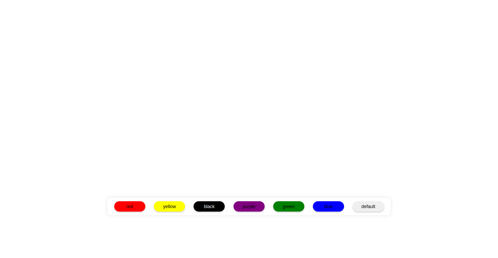
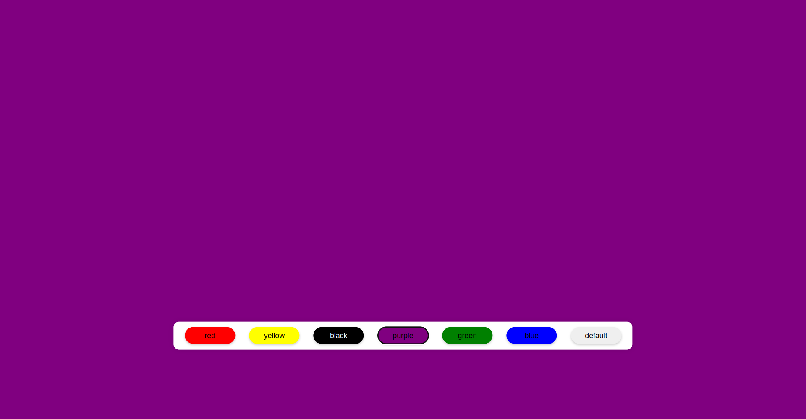

# Background Changer App

This is a basic and straightforward application featuring buttons of various colors located at the bottom center. When clicked, each button changes the background color, serving as a practice exercise for React development.

## How to Use

1. Clone this repository to your local machine.
2. Navigate to the project directory.
3. Ensure you have Node.js and npm installed on your machine.
4. Run `npm install` to install dependencies.
5. Run `npm run dev` to start the development server.
6. Click on the buttons to change the background color.

## Screenshots

Feel free to explore the code and modify it according to your needs!

### Note

This project is a simple demonstration and does not have any additional functionality beyond changing the background color.
